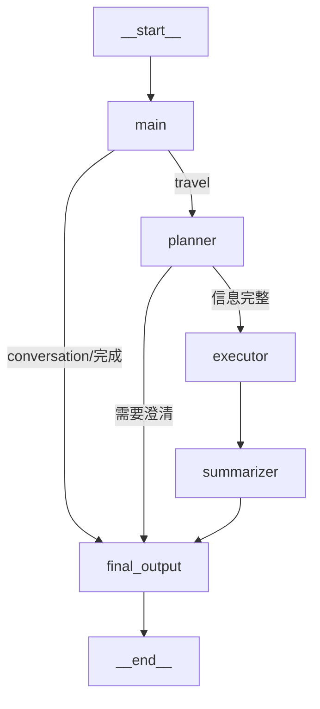

# Agent 编排架构说明（2026-08-05）

> 对应代码：`graph/workflow.py`、`graph/state.py`、`agent_nodes/`

---

## 1. 总览

基于 **LangGraph StateGraph** 的多 Agent 协作架构。用户请求经过 5 个节点的编排完成一次旅行规划/对话：

```
┌─────────────────────────────────────────────────────────────────────┐
│                         LangGraph 工作流                             │
│                                                                     │
│  main ──(travel)──→ planner ──→ executor ──→ summarizer             │
│    │                    │                            │              │
│    │                    │ (信息不完整→澄清)            │              │
│    │                    └───────→ final_output ←─────┘              │
│    │                                                              │
│    └────(conversation 直接回答)──→ final_output                     │
│                                        │                            │
│                                        ↓                            │
│                                      END                            │
└─────────────────────────────────────────────────────────────────────┘
```

**核心设计原则：**
- **流程路由**与**画像更新**解耦：main 只决定"走哪条路"，画像更新统一在 `final_output` 记忆写回
- **统一最终输出层**：所有模式的回答汇聚到 `final_output`，输出逻辑只有一份
- **每 Agent 独立上下文**：`planner_context` / `executor_context` / `summarizer_context` 互不干扰

---

## 2. 图结构与路由

### 2.1 节点清单

| 节点 | 职责 | 触发条件 |
|---|---|---|
| `main` | 查询分类（conversation/travel）+ 加载记忆 | 入口 |
| `planner` | 提取旅行参数，决定简单/复杂模式 | main 分类为 travel |
| `executor` | 执行查询（ReAct 或 Plan-then-Execute） | planner 信息完整 |
| `summarizer` | 生成最终旅行方案 | executor 完成 |
| `final_output` | 统一输出 + 记忆写回 | 任何回答路径 |

### 2.2 路由决策（Mermaid）



### 2.3 路由函数

| 函数 | 决策逻辑 |
|---|---|
| `route_after_main` | `is_complete` → final_output；否则 → planner |
| `route_after_planner` | `needs_clarification` → final_output；否则 → executor |

---

## 3. 节点详细说明

### 3.1 main — 协调者（`agent_nodes/main_agent.py`）

```
入口 → 加载记忆上下文 (router.load_context → state.memory_context)
    → LLM 分类器（Qwen3，temperature=0.3，二分类）
        ├─ conversation → LLM 直接回答（注入画像/短期记忆）→ final_answer
        └─ travel → 路由给 planner
```

**关键点：**
- 分类器是 **LLM**（不是正则），prompt 在代码内定义，返回 `conversation` / `travel`
- 分类器调用带 `tags=["query_classifier"]` 标记，**流式输出层据此跳过**（不把分类结果流给用户）
- conversation 分支的回答 prompt 注入 `memory_context.preferences`（统一画像入口）

### 3.2 planner — 意图识别（`agent_nodes/planner_agent.py`）

```
输入: user_query + 对话历史
    → Qwen3 with_structured_output 提取旅行参数
        (destination/origin/travel_days/budget/travel_date/preferences)
    → 多目的地检测（关键词 + 逗号分隔）
    → 决定 query_mode:
        ├─ simple: 简单查询（只有目的地/关键词查询）→ ReAct
        └─ full: 完整规划（缺信息 → 澄清问题；信息完整 → Plan-then-Execute）
```

**关键点：**
- 结构化输出 Pydantic：`TravelPlanExtraction`
- 简单模式判定：无天数/预算/日期 或 含简单查询关键词（天气/景点/美食等）
- 信息缺失 → `needs_clarification=True` + 澄清问题 → 直接走 final_output

### 3.3 executor — 双模式执行（`agent_nodes/executor_agent.py`）

```
输入: planner_context + executor_context
    ├─ query_mode=simple → create_react_agent（LangGraph 原生 ReAct）
    │     LLM 自主决定调哪些工具，tool calling 原生循环
    └─ query_mode=full → Plan-then-Execute
          DeepSeek R1 生成计划 → 按步骤 tool.ainvoke(params) 执行
```

**关键点：**
- simple 模式用 `create_react_agent`（替代早期手写 ReAct 循环）：
  - `pre_model_hook` / `post_model_hook` 打印推理轮次与决策
  - `prompt` 参数注入系统提示（用户需求 + 工具建议）
- full 模式：R1 规划 + 容错（某步失败不影响后续）
- 工具来自 `ToolProvider`（自动生成，无需手工定义 schema）

### 3.4 summarizer — 方案生成（`agent_nodes/summarizer_agent.py`）

```
输入: executor_context（工具结果）+ planner_context + memory_context.preferences
    ├─ simple 模式 → 简洁直接回答
    └─ full 模式 → 结构化旅行方案（交通/住宿/每日行程/预算）
    → 写入 summarizer_context.final_summary + state.final_answer
```

**关键点：**
- 画像从 `state.memory_context` 统一读取（`format_preferences_for_prompt`）
- 流式输出：chat_service 拦截此节点的 `on_chat_model_stream` 事件逐 token 推送

### 3.5 final_output — 统一输出层（`graph/workflow.py`）

```
输入: 任意路径的 final_answer
    → 兜底提取（final_answer → summarizer_context → planner 澄清）
    → 记忆写回 promote：
        ├─ Redis 短期记忆（每轮）
        ├─ 偏好提取（正则快路径 → LLM 兜底 5s 超时）→ PG user_preferences
        └─ 旅行历史检测 → PG travel_history
    → 标记 is_complete=True
```

**关键点：**
- 不调用 LLM，纯汇聚 + 写回
- 记忆写回失败不影响回答输出（try/except）
- 聊天消息**不在这里保存**（chat_service 统一负责）

---

## 4. 状态定义（`graph/state.py`）

### 4.1 GlobalState 结构

```python
class GlobalState(TypedDict):
    # 全局共享：完整对话历史（reducer: operator.add 追加）
    messages: Annotated[List[BaseMessage], operator.add]
    user_query: Optional[str]

    # 各 Agent 独立上下文
    planner_context: Optional[PlannerContext]
    executor_context: Optional[ExecutorContext]
    summarizer_context: Optional[SummarizerContext]

    # 控制流
    current_agent: Optional[str]
    next_agent: Optional[str]
    is_complete: bool

    # 统一最终输出
    final_answer: Optional[str]

    # PostgreSQL 会话 ID（记忆写回用）
    pg_session_id: Optional[str]

    # 会话标识
    session_id: Optional[str]
    user_id: Optional[str]

    # 记忆系统（入口注入，各节点读取）
    memory_context: Optional[Dict[str, Any]]
```

### 4.2 Reducer 语义

| 字段 | Reducer | 策略 |
|---|---|---|
| `messages` | `operator.add` | 追加（累积对话历史） |
| 其他所有字段 | 无（默认） | 覆盖（last writer wins） |

### 4.3 各 Agent 上下文

```python
PlannerContext:  destination/origin/travel_days/budget/travel_date/
                 preferences/query_mode/needs_clarification/...

ExecutorContext: tool_results[]/rag_results_history[]/collected_info

SummarizerContext: final_summary
```

---

## 5. 记忆系统（三层）

```
┌──────────────────────────────────────────────────────────────┐
│                     Memory Router                            │
│        请求入口统一加载（偏好总是加载，历史/知识按需）          │
└──────┬───────────────────┬───────────────────┬──────────────┘
       │                   │                   │
       ▼                   ▼                   ▼
┌──────────────┐   ┌──────────────┐   ┌────────────────────┐
│ 工作记忆      │   │ 短期记忆      │   │ 长期记忆            │
│ (进程内dict) │   │ (Redis)      │   │ (PostgreSQL+Chroma)│
│ 零延迟        │   │ TTL 30min    │   │ 偏好/旅行历史/摘要  │
└──────────────┘   └──────────────┘   └────────────────────┘
```

### 5.1 写入（每轮对话结束，final_output 触发）

| 层 | 写入内容 | 存储 |
|---|---|---|
| 短期记忆 | 本轮 user/assistant 消息 | Redis List（TTL 1800s） |
| 用户偏好 | 正则 → LLM 提取 → 白名单过滤 → append 去重 | PG `user_preferences` |
| 旅行历史 | 检测"行程安排/Day/第一天"标志 | PG `travel_history` |

### 5.2 读取（请求入口，main 触发）

```
router.load_context(session_id, user_id, user_query)
  ├─ working: 总是
  ├─ preferences: 总是（画像唯一入口）
  ├─ short_term: session 有历史就加载
  ├─ travel_history: 含"上次/去过/以前"关键词
  └─ knowledge: 含"攻略/景点/美食"关键词
    → state.memory_context（各节点从 state 读取）
```

---

## 6. 工具层（`tools/`）

```
ToolProvider（全局单例）
  ├─ MultiServerMCPClient（langchain-mcp-adapters）
  │   ├─ 12306 Server (8 tools)   火车票
  │   ├─ Gaode Server (12 tools)  高德地图
  │   ├─ bazi Server  (12 tools)  黄历
  │   ├─ biying Server(2 tools)   必应搜索
  │   └─ flight Server(4 tools)   航班
  └─ rag_search（自定义）         Chroma 知识库检索
```

- MCP 工具**自动生成**（`client.get_tools()`），无需手工定义 schema
- 同名工具用 `服务器名_工具名` 前缀区分（`tool_name_prefix=True`）
- 工具调用：`tool.ainvoke(params)` 统一入口

---

## 7. 输出层（`services/chat_service.py`）

```
前端 POST /chatMessage/stream (SSE)
  → build_state_from_messages（含 pg_session_id）
  → travel_graph.astream_events
      ├─ on_chain_start → status 事件（"正在规划行程..."）
      ├─ on_tool_start  → status 事件（"正在查询天气..."）
      └─ on_chat_model_stream（summarizer/main 节点）→ content 逐 token
          （query_classifier tag 跳过分类器输出）
  → 结束：统一读 state.final_answer 兜底
  → done 事件
```

**流式拦截规则：**
- `summarizer` 节点：所有 token 流式
- `main` 节点：跳过 `query_classifier` tag 的 LLM（分类器）

---

## 8. 一次完整请求的生命周期

```
用户: "帮我规划从上海去杭州3天，预算3000"

[main]          加载记忆（偏好/历史）→ LLM 分类: travel
[planner]       提取: 上海→杭州, 3天, 3000元 → query_mode=full
[executor]      R1 制定计划 → 查天气/酒店/车票/黄历
[summarizer]    生成结构化旅行方案（含画像个性化）
[final_output]  记忆写回: 偏好预算3000 → PG; 杭州 → travel_history
                → final_answer 输出
[chat_service]  359 个流式 token → SSE → 前端打字机效果
```

```
用户: "我喜欢古镇，不喜欢热闹"

[main]          加载记忆 → LLM 分类: conversation
[main]          直接回答（注入画像 + 友好确认）
[final_output]  正则/LLM 提取: liked=[古镇], disliked=[热闹] → PG
```
